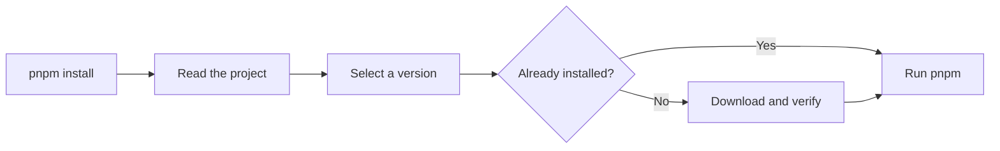

# jup

<!-- automd:badges color=yellow -->

[](https://npmjs.com/package/jup)
[](https://npm.chart.dev/jup)

<!-- /automd -->

> Pin and run the right package manager or runtime for every project.

**jup** (can be pronounced “yup” too!) manages versions of package managers and runtimes.
It is fast, small, and has no dependencies. It supports npm, pnpm, Yarn, aube,
Bun, Deno, nub, and Node.js.

Each project can choose a version. jup downloads and checks that version, saves
it on your computer, and runs it. After the exact version is installed, jup can
run it without an internet connection.

> [!WARNING]
> jup is experimental. Its behavior may change between releases.

## Quick start

### 1. Install jup

```sh
curl -fsSL https://jup.unjs.io/install.sh | sh
```

On Windows:

```powershell
irm https://jup.unjs.io/install.ps1 | iex
```

With an existing Node.js installation:

```sh
npx jup self-install
```

### 2. Enable familiar commands

```sh
jup enable
```

This creates shims so commands such as `pnpm`, `yarn`, and `npm` pass through
jup.

### 3. Pin a tool

From your project directory:

```sh
jup use pnpm@^12
```

This keeps the range in `package.json` and records the selected release in
`jup.lock`. To keep the range without committing a lockfile:

```sh
jup use --no-lockfile pnpm@^12
```

Without a project `jup.lock`, each checkout chooses a matching release
independently. When `node_modules` already exists, jup may reuse that registry
answer for 24 hours from the disposable `node_modules/.jup/jup.lock` cache.

Then keep using the normal command:

```sh
pnpm install
pnpm --version
```

Without shims, put `jup` before the tool command:

```sh
jup pnpm install
jup node@^22 script.js
```

Run `jup info` at any time to inspect the selected project, version, local store,
network settings, and shims.

[Read the complete getting-started guide →](https://jup.unjs.io)

## Why jup?

- **One version for the whole team.** The project records the tool it needs.
- **Normal commands.** Keep typing `pnpm`, `yarn`, or `npm` after enabling shims.
- **Checked downloads.** Artifacts are checked against pinned digests or trusted
  registry metadata before installation.
- **Useful offline behavior.** Already-installed exact versions run without a
  registry request.
- **Reproducible ranges.** Keep a range in the project and commit its selected
  version in `jup.lock`.
- **No plugins or telemetry.** The supported tool table is built into jup.

## How it works



jup passes arguments, input, output, exit codes, and signals through to the
selected tool. It manages the tool itself, not your project dependencies:
`pnpm install` still installs those dependencies.

Package-manager pins live in `devEngines.packageManager` in `package.json`.
Node.js pins live in `devEngines.runtime`; jup can also read `.nvmrc`. Existing
top-level `packageManager` pins remain supported.

## Documentation

- [Get started](https://jup.unjs.io)
- [Projects, pins, ranges, and workspaces](https://jup.unjs.io/projects)
- [CI, containers, and offline installs](https://jup.unjs.io/ci)
- [Registries, authentication, TLS, and proxies](https://jup.unjs.io/registry)
- [Command reference](https://jup.unjs.io/commands)
- [Integrity and security model](https://jup.unjs.io/security)
- [Environment and settings](https://jup.unjs.io/settings)
- [Moving from Corepack](https://jup.unjs.io/corepack)
- [Troubleshooting](https://jup.unjs.io/troubleshooting)
- [Programmatic API](https://jup.unjs.io/api)

## Corepack compatibility

jup provides a `corepack` command and supports existing Corepack project pins and
workflows. New package-manager pins are written to `devEngines.packageManager`,
which Corepack itself does not read.

[Read the migration guide →](https://jup.unjs.io/corepack)

## Credits

jup builds on the work of
[Corepack](https://github.com/nodejs/corepack) and its contributors. Its
compatibility behavior is modeled on Corepack v0.35.0.

## License

Published under the [MIT License](./LICENSE).

Portions derived from [Corepack](https://github.com/nodejs/corepack), Copyright
© Corepack contributors, are also MIT licensed. See [LICENSE](./LICENSE) for the
full notice.
