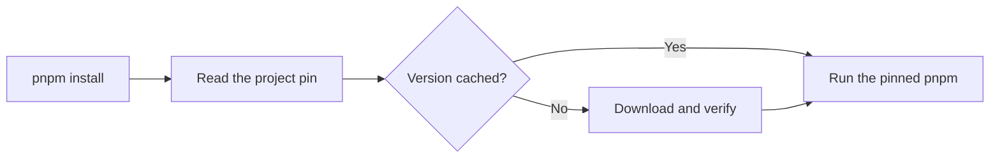

# jup

<!-- automd:badges color=yellow -->

[](https://npmjs.com/package/jup)
[](https://npm.chart.dev/jup)

<!-- /automd -->

**jup (pronounced “yup”) makes sure every developer, CI job, and container runs the tool version selected by the project.**

jup is a fast, small tool version manager and a safer, more capable alternative to [Corepack](https://github.com/nodejs/corepack). It supports npm, pnpm, Yarn, aube, Bun, Deno, nub, and Node.js.

Pin a tool once, then keep using its normal command:

```sh
jup enable        # set up the familiar tool commands once
cd my-project
jup use pnpm@12   # pin pnpm 12 and run its install command
pnpm add lodash   # later commands use the pinned release
```

This prevents different machines from silently using different versions. Existing exact Corepack pins for npm, pnpm, and Yarn usually work without changes.

## How it works

With jup's command shims enabled, a familiar command such as `pnpm install` passes through jup first:



The command and its arguments stay the same. jup reads the version selected by the project, caches it for later offline use, and hands control to that version of the tool.

Package managers are declared in `packageManager`; Node.js is declared in `devEngines.runtime` or, as a fallback, `.nvmrc`. Bun, Deno, nub, and Node shims are opt-in so jup does not unexpectedly replace commands already installed on your machine.

## Quick start

Follow the [Start guide](./docs/1.start.md) to install jup, or use these commands after installation:

```sh
jup enable
cd my-project
jup use pnpm@12
```

Without shims, put `jup` before the tool command:

```sh
jup pnpm install
```

Run `jup info` to inspect the selected project, version, cache, and shims.

## Documentation

- [Introduction](./docs/0.index.md)
- [Getting started](./docs/1.start.md)
- [Projects and workspaces](./docs/2.projects.md)
- [CI and offline](./docs/3.ci.md)
- [Registries and networking](./docs/4.registry.md)
- [Commands](./docs/5.commands.md)
- [Security](./docs/6.security.md)
- [Environment](./docs/7.settings.md)
- [Moving from Corepack](./docs/8.corepack.md)
- [Troubleshooting](./docs/9.troubleshooting.md)

## Credits

jup builds on the work of [Corepack](https://github.com/nodejs/corepack) and its contributors. Its behavior is modeled on Corepack v0.35.0, so existing `packageManager` pins, commands, and messages keep working. Thanks to the Corepack contributors for the design jup started from.

## License

Published under the [MIT](./LICENSE) license.

Portions derived from [Corepack](https://github.com/nodejs/corepack), Copyright © Corepack contributors, also MIT licensed. See [LICENSE](./LICENSE) for the full notice.
