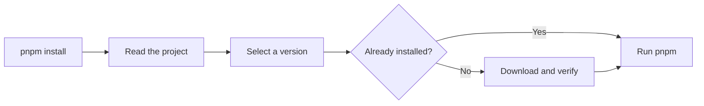

> Pin and run the right package manager or runtime for every project.

jup (can be pronounced “yup” too!) manages versions of package managers and runtimes. It supports npm, pnpm,
Yarn, aube, Bun, Deno, nub, and Node.js.

Each project can choose a version. jup downloads and checks that version, saves
it on your computer, and runs it. After the exact version is installed, jup can
run it without an internet connection.

::warning
jup is experimental. Its behavior may change between releases.
::

## Quick start

### 1. Install jup

Choose the command for your system:

```sh [macOS / Linux]
curl -fsSL https://jup.unjs.io/install.sh | sh
```

```powershell [Windows]
irm https://jup.unjs.io/install.ps1 | iex
```

```sh [Existing Node.js]
npx jup self-install
```

Check the installation:

```sh
jup --version
```

If the command is missing, add the directory printed by the installer to `PATH`,
then open a new terminal.

### 2. Enable familiar commands

```sh
jup enable
```

This creates shims so commands such as `pnpm`, `yarn`, and `npm` pass through
jup. If the selected directory is not on `PATH`, jup prints the shell line you
need.

### 3. Pin a package manager

From your project directory:

```sh
jup use pnpm@^12
```

jup selects a matching release, verifies and installs it, then updates the
project. The range stays in `package.json`, while the selected release is
recorded in `jup.lock`.

To keep the range without committing a lockfile:

```sh
jup use --no-lockfile pnpm@^12
```

Without a project `jup.lock`, each checkout chooses a matching release
independently. When `node_modules` already exists, jup may reuse that registry
answer for 24 hours from the disposable `node_modules/.jup/jup.lock` cache. For
most package managers, `use` also runs that manager's install command. Review
dependency and lockfile changes before committing them.

Now use the normal command:

```sh
pnpm install
pnpm --version
```

Without a shim, use jup explicitly:

```sh
jup pnpm install
```

### 4. Inspect the setup

```sh
jup info
```

The report explains the selected project, version resolution, installed tools,
shims, and registry settings. `jup info --json` provides the same kind of report
for scripts and support tools. It makes no network request and hides credential
values.

## Why use jup?

- **One version for the whole team.** The project records the tool it needs.
- **Normal commands.** Keep typing `pnpm`, `yarn`, or `npm` after enabling shims.
- **Checked downloads.** jup checks a pinned digest or registry metadata before
  it installs an artifact.
- **Useful offline behavior.** Installed versions can run without a registry.
- **Reproducible ranges.** A project can keep a range and commit its selected
  version in `jup.lock`.
- **No plugins or telemetry.** The supported tool list is built into jup.

## How it works



jup passes arguments, input, output, exit codes, and signals through to the tool.
It does not install your project dependencies by itself. For example, `jup
install` prepares the package-manager program; `pnpm install` still installs the
project's dependencies.

## Project files

Package managers are declared under `devEngines.packageManager` in
`package.json`, which is where `jup use` writes the pin:

```json
{
  "devEngines": {
    "packageManager": {
      "name": "pnpm",
      "version": "12.0.0"
    }
  }
}
```

An existing top-level `packageManager` is still read; writing a pin moves it into
`devEngines.packageManager` and removes it.

Node.js uses `devEngines.runtime` instead:

```json
{
  "devEngines": {
    "runtime": {
      "name": "node",
      "version": "^22"
    }
  }
}
```

jup can also read `.nvmrc` when no Node runtime is declared in the manifest.

## Installation details

The macOS, Linux, and Windows installers use a recent Node.js already on the
machine. They can also use Bun to bootstrap jup. If neither is available, they
download a private Node.js runtime beside jup's store. That runtime is not added
to `PATH`, and `jup cache clean` does not remove it.

The POSIX installer needs `tar` and either `curl` or `wget`. The Windows installer
needs the `tar.exe` included in modern Windows. Node.js does not publish a musl
artifact through the source jup uses, so Alpine users must install a suitable
Node.js first.

Choose another command directory or jup release like this:

```sh
curl -fsSL https://jup.unjs.io/install.sh | sh -s -- --dir "$HOME/bin" --version latest
```

```powershell
& ([scriptblock]::Create((irm https://jup.unjs.io/install.ps1))) -Dir "$HOME\bin" -Version latest
```

When using `npx`, it downloads a temporary copy. `self-install` then copies that
running jup to `<JUP_HOME>/self/<version>` and creates the `jup` and `corepack`
commands in jup's per-user bin directory. The permanent copy does not depend on
npm's global install directory, and `jup cache clean` does not remove it.

If an existing `corepack` owns that command name, inspect it first. To
deliberately replace it, run:

```sh
npx jup self-install --force
```

jup records the displaced command so `jup disable` can restore it later. A
global `npm install -g jup` is still supported, but is not recommended.

### Upgrade jup

A self-installed jup can upgrade itself:

```sh
jup self-upgrade
```

`self-upgrade` asks the registry for the latest published jup, verifies the
registry signature and downloaded bytes, installs the new copy under
`<JUP_HOME>/self`, and updates the `jup` and `corepack` commands.

This differs from `jup up`: `up` updates the tool pinned by the current project,
while `self-upgrade` updates jup itself. Use the same `--install-directory` or
`--system` option used for installation when jup cannot automatically find those
command links. Add `--force` only when deliberately replacing a command now
owned by another tool.

## Managing shims

A **shim** is a small launcher on `PATH`. It lets `pnpm install` pass through jup.
Shims are optional; without them, use commands such as:

```sh
jup pnpm install
jup node@^22 script.js
```

`jup install` runs the install command of whichever manager the project pins,
without naming it, and `jup run` does the same for a project script. A word jup
does not recognize is a script name too:

```sh
jup install
jup install --frozen-lockfile
jup run build
jup lint
```

jup will not overwrite a foreign command. If `jup enable` reports a conflict,
inspect the path first:

```sh
command -v pnpm   # POSIX
jup info
```

In PowerShell, use `Get-Command pnpm`. Use `--force` only when you want jup to
take that name:

```sh
jup enable --force
```

jup backs up a displaced entry and records it so `jup disable` can restore it.

Choose an existing writable shim directory with:

```sh
jup enable --install-directory "$HOME/bin"
```

For a machine-wide or container installation:

```sh
sudo jup enable --system
```

`--system` selects `/usr/local/bin` on POSIX or `%ProgramData%\jup\bin` on
Windows. It does not fall back to a user directory when that location is not
writable.

A bare `enable` avoids taking over tools people often install separately. Name
those tools when you want their shims:

```sh
jup enable bun deno nub node
```

::warning
`jup enable node` can put jup's `node` ahead of your current Node.js for every
shell command. You do not need this shim to run a selected Node version. Use
`jup node@^22 script.js` instead.
::

To leave your existing npm command alone:

```sh
jup enable --exclude npm
```

## Next steps

1. [Learn how project pins work](/projects)
2. [Set up CI and offline builds](/ci)
3. [Configure registries and authentication](/registry)
4. [Read the command reference](/commands)

If something looks wrong, start with `jup info`.
