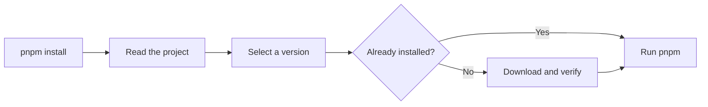

> Run the tool version your project asks for.

::warning
jup is experimental. Its behavior may change between releases.
::

jup is a version manager for package managers and runtimes. It supports npm,
pnpm, Yarn, aube, Bun, Deno, nub, and Node.js.

A project chooses a version. jup downloads it, checks it, keeps it in a local
store, and runs it:

```sh
jup enable
cd my-project
jup use pnpm@^12
pnpm install
```

After the first download, the same version starts from the local store. An exact,
already-installed version does not need the network.

## Why use jup?

- **One version for the whole team.** The project records the tool it needs.
- **Normal commands.** Keep typing `pnpm`, `yarn`, or `npm` after enabling shims.
- **Checked downloads.** jup checks a pinned digest or registry metadata before
  it installs an artifact.
- **Useful offline behavior.** Installed versions can run without a registry.
- **Reproducible ranges.** A project can keep a range and commit its selected
  version in `jup.lock`.
- **No plugins or telemetry.** The supported tool list is built into jup.

## The basic flow



jup passes arguments, input, output, exit codes, and signals through to the tool.
It does not install your project dependencies by itself. For example, `jup
install` prepares the package-manager program; `pnpm install` still installs the
project's dependencies.

## Project files

Package managers are declared under `devEngines.packageManager` in
`package.json`, which is where `jup use` writes the pin:

```json
{
  "devEngines": {
    "packageManager": {
      "name": "pnpm",
      "version": "12.0.0"
    }
  }
}
```

An existing top-level `packageManager` is still read and kept up to date.

Node.js uses `devEngines.runtime` instead:

```json
{
  "devEngines": {
    "runtime": {
      "name": "node",
      "version": "^22"
    }
  }
}
```

jup can also read `.nvmrc` when no Node runtime is declared in the manifest.

## Shims are optional

A **shim** is a small launcher on `PATH`. It lets `pnpm install` pass through jup.
Without shims, use the explicit form:

```sh
jup pnpm install
jup node@^22 script.js
```

A bare `jup enable` installs shims for the default package-manager set. Tools that
commonly have a separate system installation, including Node.js, are opt-in.

## Start here

1. [Install jup and pin a tool](./start)
2. [Learn how project pins work](./projects)
3. [Set up CI and offline builds](./ci)
4. [Read the command reference](./commands)

If something looks wrong, run `jup info`. It stays offline and explains the
project, resolution, store, registry settings, and shims jup found.
