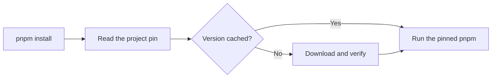

# Jup

> jup (pronounced “yup”) makes sure every developer, CI job, and container runs the tool version selected by the project.

jup is a tool version manager and a safer, more capable alternative to [Corepack](https://github.com/nodejs/corepack#readme). It supports [npm](https://docs.npmjs.com/), [pnpm](https://pnpm.io/), [Yarn](https://yarnpkg.com/), [aube](https://aube.jdx.dev/), [Bun](https://bun.sh/docs), [Deno](https://docs.deno.com/), [nub](https://nubjs.com/), and [Node.js](https://nodejs.org/docs/latest/api/).

Pin a tool once, then keep using its normal command:

```sh
jup enable        # set up the familiar tool commands once
cd my-project
jup use pnpm@12   # pin pnpm 12 and run its install command
pnpm add lodash   # later commands use the pinned release
```

This prevents developers, CI jobs, and containers from silently using different versions. Existing exact Corepack pins for npm, pnpm, and Yarn usually work without changes, while jup also supports reproducible ranges, more tools, stronger network handling, and safer shims. See [Corepack](./corepack) for a quick comparison and migration guide.

## How it works

With jup's command shims enabled, a familiar command such as `pnpm install` passes through jup first:



The command and its arguments stay the same. jup reads the version selected by the project, caches it for later offline use, and hands control to that version of the tool.

Package managers are declared in `packageManager`; Node.js is declared in `devEngines.runtime` or, as a fallback, `.nvmrc`. npm, pnpm, Yarn, and aube get shims by default. Bun, Deno, nub, and Node are opt-in so jup does not unexpectedly replace commands already installed on your machine.

## Fast and small

jup adds about **8 ms** when it runs a cached tool. It loads 86 kB of JavaScript (22 kB gzipped), and the published package is 309 kB.

Once a version is cached, jup does not download anything or use the network.

These results come from `pnpm bench` on Node.js 24 for Linux x64. Results vary by machine.

::note
jup is available on npm. Follow the [Start guide](./start) to install it.
::

## Next steps

- [Get started](./start) — install jup and pin your first package manager.
- [Configure a project](./projects) — learn about versions, ranges, workspaces, and lock files.
- [Use jup in CI](./ci) — prepare caches and offline environments.
- [Compare with Corepack](./corepack) — understand the benefits, compatibility, and migration steps.
- [Explore the commands](./commands) — see the complete CLI reference.
